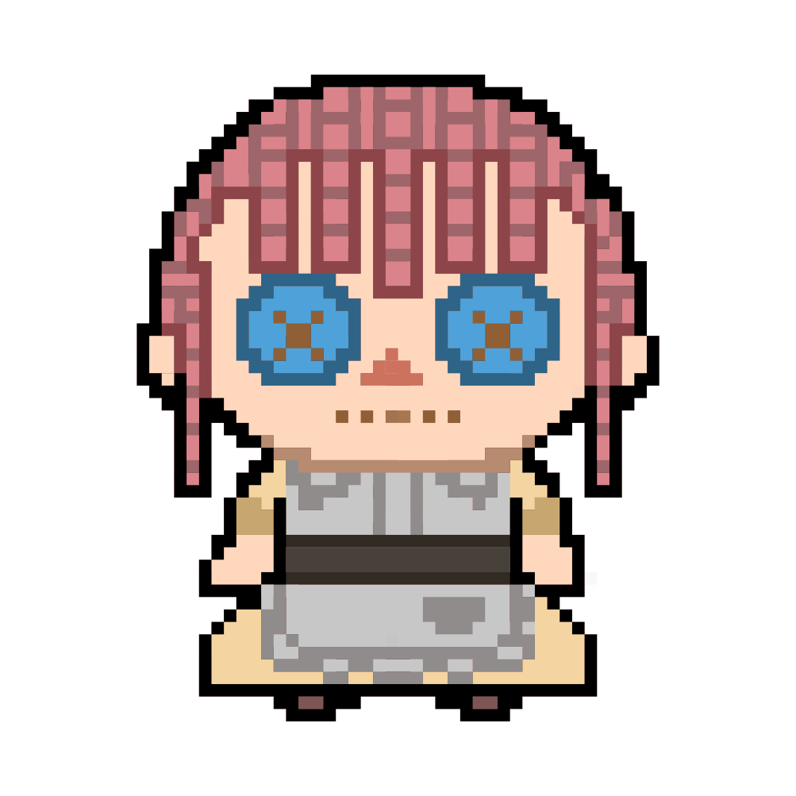
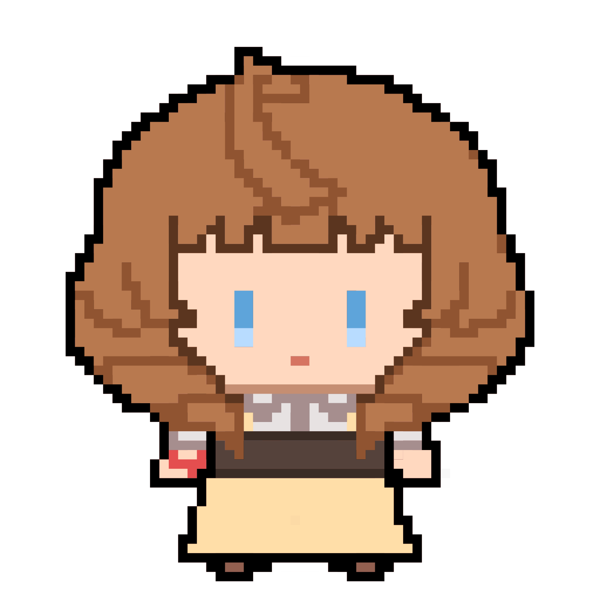

##  Skills

###  Lang and Frameworks

   

###  Infra and Tools

    

##  Art Tools

 -FF6FAE?style=for-the-badge&logo=adobephotoshop&logoColor=white>) 

##  Steam Account

##  그림 작업물

| 이름        | 링크                                                |
| ----------- | --------------------------------------------------- |
| 개인 작업물 | https://github.com/sungminjung066-lang/eyes-of-doll |
| 취미 작업물 | https://github.com/sungminjung066-lang/hobby-art    |

##  개인 프로젝트

| 이름                               | 깃허브 링크                                                | 배포 링크                                 |
| ---------------------------------- | ---------------------------------------------------------- | ----------------------------------------- |
| 랜덤 룰렛                          | https://github.com/sungminjung066-lang/random-roulette     | https://random-roulette-dusky.vercel.app/ |
| 랜덤 슬롯 머신                     | https://github.com/sungminjung066-lang/random-slot-machine | https://random-slot-machine.vercel.app/   |
| 2차 창작 기반 그림 리퀘스트 사이트 | https://github.com/sungminjung066-lang/request_site        | https://request-site-lime.vercel.app/     |
| 메모장                             | https://github.com/sungminjung066-lang/Memo                | https://memo-app-steel.vercel.app/        |

##  기타 프로젝트

| 이름              | 깃허브 링크                                        | 배포링크                                                 |
| ----------------- | -------------------------------------------------- | -------------------------------------------------------- |
| 1만 시간의 법칙   | https://github.com/sungminjung066-lang/10000hours  | X                                                        |
| 랜딩 페이지       | https://github.com/sungminjung066-lang/landing     | X                                                        |
| 오픈마켓 프로젝트 | https://github.com/sungminjung066-lang/open-market | https://ragtag-band.github.io/open-market/web/index.html |
